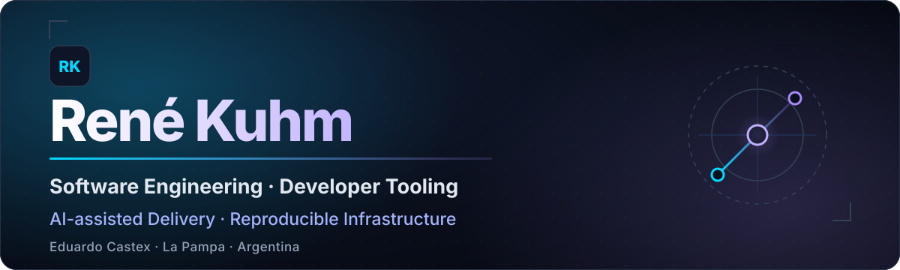

<div align="center">
  
</div>

<p align="center">
  <strong>Software Engineer · Developer Tooling · AI-assisted Delivery · Reproducible Infrastructure</strong>
</p>

<p align="center">
  Construyo herramientas y productos donde la arquitectura, la trazabilidad y la verificación forman parte del sistema.
</p>

<p align="center">
  <a href="https://github.com/Rene-Kuhm/flow-engineering"></a>
  <a href="https://tecnodespegue.com"></a>
  <a href="https://www.linkedin.com/in/rene-kuhm"></a>
  <a href="mailto:renekuhm2@gmail.com"></a>
</p>

---

## Ingeniería orientada a evidencia

Soy René Kuhm, ingeniero de software de Argentina. Trabajo en la intersección entre **developer tooling, sistemas full-stack, automatización asistida por IA e infraestructura reproducible**.

> **In English:** I build developer tools, full-stack products and reproducible infrastructure with explicit architecture, bounded automation and evidence-based delivery.

También aporto diez años de experiencia práctica en infraestructura FTTH, una base que influye en cómo diseño sistemas: límites explícitos, operación observable y recuperación planificada.

Mi criterio de entrega es simple:

- convertir intención y restricciones en artefactos revisables;
- mantener los cambios pequeños, verificables y recuperables;
- tratar tests, documentación, seguridad y operación como parte del diseño;
- diferenciar con claridad producción, desarrollo activo, prototipos y trabajo histórico.


## Proyecto principal · `flow-engineering`

<p>
  <a href="https://github.com/Rene-Kuhm/flow-engineering"></a>
  <a href="https://pypi.org/project/flow-engineering/"></a>
  
  
</p>

**[`flow-engineering`](https://github.com/Rene-Kuhm/flow-engineering) es mi trabajo central:** un orquestador open source para convertir desarrollo asistido por agentes en un proceso explícito, gobernado y verificable.

```text
INTENT → CONTEXT/PROPOSAL → DESIGN → SPEC → TASKS → APPLY → VERIFY → ARCHIVE
```

No es una colección de prompts. El repositorio implementa un sistema con responsabilidades separadas:

| Superficie | Responsabilidad verificable |
|---|---|
| **Core Python** | Máquina de estados, detección de drift, snapshots deterministas y contratos de dominio. |
| **CLI `flow`** | Ciclo SDD completo: propuesta, diseño, especificación, tareas, aplicación, verificación y archivo. |
| **MCP opcional** | Adaptador **read-only** para inspección acotada; no reemplaza al core ni ejecuta código del proyecto. |
| **Gobernanza** | Constitución versionada, Spec-as-Truth, TDD estricto y cambios grandes divididos en PRs revisables. |
| **Evidencia** | Tests automatizados, CI para Python 3.12/3.13, lockfile `uv`, documentación de arquitectura y políticas de contribución y seguridad. |

**Por qué existe:** los agentes pueden generar código rápidamente, pero velocidad sin contexto persistente, límites y verificación produce drift. `flow-engineering` conecta decisiones, estructura del código y comportamiento entregado para que el proceso pueda auditarse y recuperarse entre sesiones.

**Explorar:** [repositorio](https://github.com/Rene-Kuhm/flow-engineering) · [documentación](https://github.com/Rene-Kuhm/flow-engineering/tree/main/docs) · [paquete en PyPI](https://pypi.org/project/flow-engineering/) · [CI](https://github.com/Rene-Kuhm/flow-engineering/actions)

## Trabajo seleccionado

### 🟢 Producción · [tecnodespegue-landing](https://github.com/Rene-Kuhm/tecnodespegue-landing)

La **única web actual de TecnoDespegue**: Astro, TypeScript y Tailwind, con generación estática, endpoints serverless, validación predeploy y auditorías de rendimiento documentadas. **[Ver sitio →](https://tecnodespegue.com)**

> Los repositorios con nombres similares corresponden a iteraciones anteriores y no representan el sitio activo.

### 🔵 Activo · [infra](https://github.com/Rene-Kuhm/infra)

Infraestructura NixOS declarativa con flakes, Secure Boot, LUKS, impermanence, secretos mediante `sops-nix`, despliegues reproducibles y documentación de recuperación.

### 🟡 MVP release-ready · [Vaulta](https://github.com/Rene-Kuhm/vaulta)

Gestor offline-first para Android y Windows con Argon2id, AES-256-GCM, almacenamiento seguro nativo y actualizaciones firmadas. **Todavía no cuenta con auditoría criptográfica externa.**

### 🧪 Prototipo de investigación · [KineIA](https://github.com/Rene-Kuhm/KineIA)

Asistente RAG para conocimiento de kinesiología con FastAPI, Qdrant, PostgreSQL, Next.js y Docker Compose. Backend y frontend son funcionales; testing y despliegue siguen pendientes.

## Cómo diseño y entrego sistemas

- **Arquitectura con límites.** Responsabilidades separadas, interfaces públicas y dependencias explícitas antes de sumar abstracciones.
- **Verificación proporcional al riesgo.** Tests, CI, checks estáticos y evidencia de ejecución: una afirmación no sustituye una verificación.
- **Seguridad por frontera.** Mínimo privilegio, secretos cifrados, automatización acotada y límites documentados, incluido lo que todavía no está auditado.
- **Infraestructura recuperable.** Entornos reproducibles, configuración declarativa, versiones fijadas, rollback y procedimientos de recuperación.
- **Entrega revisable.** Vertical slices pequeños, especificaciones trazables y PRs divididos cuando crece la carga de revisión.
- **Estado honesto.** Producción, MVP, prototipo y legacy se comunican como estados distintos.

## Áreas de trabajo

```text
Developer tooling   Python · CLI · MCP · SDD · agent workflows · context engineering
Applications        TypeScript · React · Next.js · Astro · FastAPI · Flutter · PostgreSQL
Infrastructure      NixOS · Docker · GitHub Actions · Linux · secrets · deployment automation
Networks            FTTH · fiber infrastructure · ISP operations · technical consulting
```

No defino seniority por una lista de tecnologías, sino por la capacidad de **tomar decisiones con trade-offs, reducir riesgo, dejar evidencia y operar lo construido**.

## Trabajo abierto y conocimiento compartido

- Mantengo [`flow-engineering`](https://github.com/Rene-Kuhm/flow-engineering) como proyecto open source con licencia MIT, guía de contribución y política de seguridad.
- Documento decisiones, límites y procedimientos operativos dentro de los repositorios, junto al código que gobiernan.
- Comparto contenido técnico en [YouTube · @tecnodespegue](https://youtube.com/@tecnodespegue).
- Mi actividad y repositorios públicos están disponibles en [GitHub](https://github.com/Rene-Kuhm?tab=repositories).

## Conversemos

Trabajo con equipos y organizaciones que necesitan **developer tooling, automatización con IA bajo límites claros, productos full-stack, infraestructura reproducible o consultoría FTTH**.

Estoy en Eduardo Castex, La Pampa, Argentina, y colaboro de forma remota.

<p align="center">
  <a href="https://tecnodespegue.com"></a>
  <a href="https://www.linkedin.com/in/rene-kuhm"></a>
  <a href="mailto:renekuhm2@gmail.com"></a>
</p>

<p align="center">
  <sub>Architecture is a promise. Verification is the evidence.</sub>
</p>
